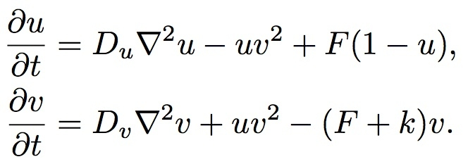
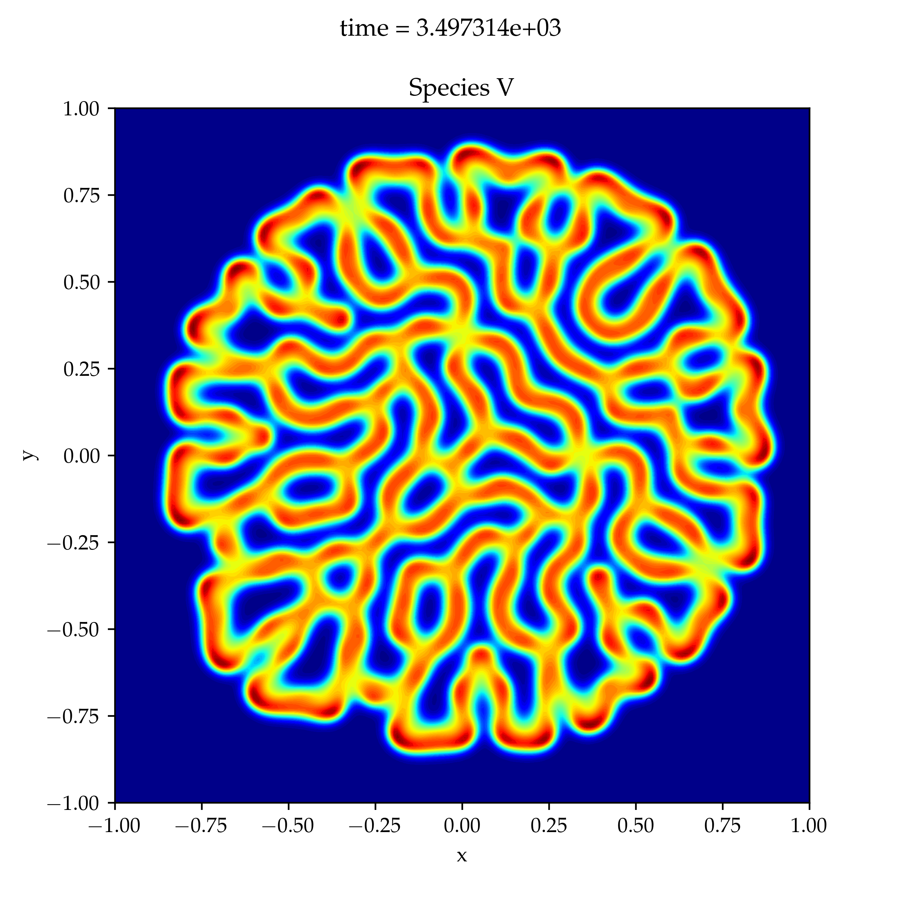
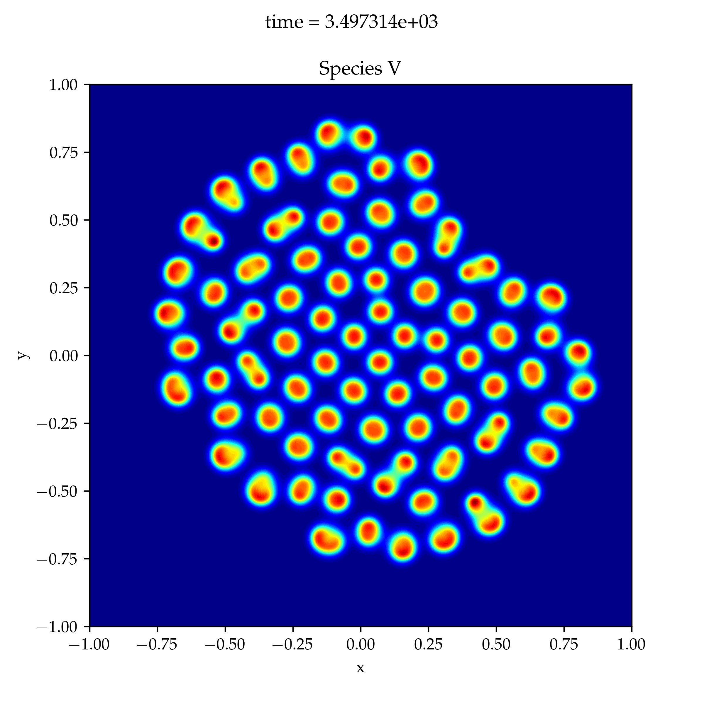

# Gray-Scott model

## Governing equations




## Rolls and spots

A nice demo for the sensitivity of the parameters `F` and `kappa` is given by
Prof. Trefethen [here](https://www.chebfun.org/examples/pde/GrayScott.html).

The first parameter set generates a beautiful pattern with "rolls".  The
parameters for this solution are

* `F = 0.04`
* `kappa = 0.06`



By slightly perturbing `F` a completely different solution is found, this time a
"spot" pattern is observed.  The parameters for this simulation are

* `F = 0.025`
* `kappa = 0.06`




## Running the code

The Gray-Scott model is implemented in `python/gray_scott.py`.  A simulation
wrapper around the `GrayScott` class is implemented in
`python/run_simulation.py`.  A simulation can be started with

```
./run_simulation.py
```

which integrates the system until time `T=3500` using the default parameter
`F=0.04` and `k=0.06` (kappa).  Output is generated every `100` integration
steps.  A list of all options can be obtained with

```
./run_simulation.py --help
```

Running a simulation for parameter `F=0.02` and `k=0.06` is achieved by

```
./run_simulation.py -F 0.02 -k 0.06 --outdir sim_F0.02_k0.06
```

where in addition the output is written to a directory `sim_F0.02_k0.06` in the
current folder.  If the `--outdir` option is omitted then output is written into
the current directory.


### Generating movies from output frames

If the option `--movie` is specified, the simulation wrapper will generate a
movie from dumped frames.  This option requires that `ffmpeg` is installed on
the system ([ffmpeg download](https://ffmpeg.org/download.html)).  The default
frame dump frequency is every `100` integration steps.  For a high-resolution
(temporal resolution) specify more frequent dumps with the `--dump_freq` option.
For example, 10-times more frames are generated with `--dump_freq 10`.
